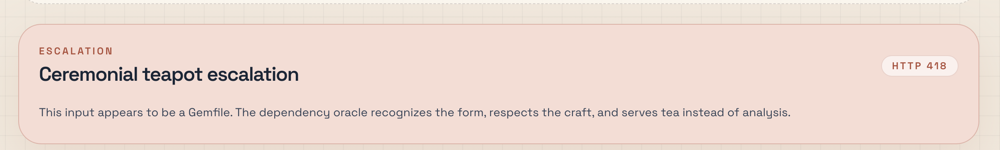

*This is a submission for the [DEV April Fools Challenge](https://dev.to/challenges/aprilfools-2026)*

## What I built

I built Semver in Retrograde, a dependency astrology app for npm projects dressed up like enterprise software.

You paste a `package.json`, click "Analyze my dependency aura", and get a straight-faced executive report about the project's emotional state. It gives you Aura Stability, Chaos Index, Peer Dependency Tension, Mercury Status, the dependency Big 3, a prophecy, a lucky command, and a share card that looks ready for an internal quarterly review.

That contrast is the joke. The interface looks like a serious dashboard. The output is dependency mysticism delivered in the tone of an operations meeting.

I also added one feature that makes me disproportionately happy: if you paste something that looks like `requirements.txt` or a `Gemfile`, the app returns **418 I'm a teapot**. Wrong ecosystem, wrong beverage.

## Demo

Live demo: [https://semver-in-retrograde.vercel.app/](https://semver-in-retrograde.vercel.app/)

Repo: [trknhr/semver-in-retrograde](https://github.com/trknhr/semver-in-retrograde)

This is the demo flow I used:

1. Click **Analyze my dependency aura**
2. Show the KPI cards and the Big 3
3. Scroll to the prophecy and lucky command
4. End on the share card

## Code

The code is here:

- [GitHub Repository](https://github.com/trknhr/semver-in-retrograde)

The app has a clean split. Local code parses and scores the manifest. Gemini writes the executive reading. So the same manifest always produces the same numbers, while the model handles the polished nonsense.

## How I built it

I used:

- Next.js
- TypeScript
- Tailwind CSS
- server-side Gemini API
- Zod

The architecture is more serious than the premise. That felt appropriate.

### 1. Deterministic manifest analysis

The first step is completely local.

The app parses `package.json`, flattens the dependency sections, inspects the scripts block, and turns the manifest into a feature set. It looks at things like:

- dependency counts
- `peerDependencies`
- `overrides` / `resolutions`
- wildcard and `latest` versions
- `pre*` / `post*` scripts
- `postinstall`
- package manager hints
- framework / test / build tool fingerprints

Those features feed a weighted scoring model. I wanted the joke to start from real manifest behavior, not from a model improvising a vibe.

Pinned versions help Aura Stability. Wildcards, `latest`, extra scripts, and override-heavy manifests drag it down. Chaos Index climbs when the project has loose version ranges, lifecycle scripts, `postinstall`, suspicious script names, or workspace sprawl. Peer Dependency Tension rises when the package asks other people to satisfy more of its needs. Boundary Issues is really a score for governance by exception, so `overrides`, `resolutions`, and workspace hints push it upward. Trust Issues gets worse when the manifest is private, carries a `postinstall`, or leans on suspicious scripts and `latest` tags. Mercury Status comes from lifecycle-script severity, especially `pre*`, `post*`, and `postinstall`.

So yes, the result is silly. But it is silly in a deterministic way.

Those signals show up in the product as Aura Stability, Chaos Index, Peer Dependency Tension, Boundary Issues, Trust Issues, and Mercury Status.

All of this is computed locally so the core behavior stays deterministic.

### 2. Gemini for the narrative layer

I used Gemini on the server for the parts that needed tone rather than math:

- executive summary
- sun / moon / rising interpretations
- red flags
- prophecy
- lucky command
- share caption

Gemini does not decide the scores. It gets the extracted features and the computed numbers, then turns them into a dead-serious reading.

The app asks for structured JSON and validates the result with Zod before rendering anything. That kept the product funny without handing core logic to the model.

### 3. UI direction

I did not want this to look like a horoscope app. I wanted it to look like a corporate audit dashboard that had developed a spiritual problem.

The design goal was:

"This should look like a compliance product that got trapped in a spiritual crisis."

### 4. My favorite April Fools detail

If the input looks like Python or Ruby dependency files, the app returns **418**.

That part is useless, correct, and deeply satisfying.

### 5. Eval, because the joke works better if the nonsense is measured

I did not want the AI layer to run on hope.

So I added a small `promptfoo` harness around the reading endpoint and treated it like a real structured-output feature.

The eval setup has two layers. The first is deterministic and checks response contract, writing constraints, and fixture-specific signal coverage. The second uses LLM-as-a-judge rubrics for tone and grounding.

The deterministic checks cover things like:

- the endpoint returns the full expected JSON shape
- the response stays in `live` mode for the eval fixtures
- the copy does not drift into practical engineering advice
- the `luckyCommand` still looks like a shell command
- the response actually reflects the manifest signals it was supposed to notice

Then I added judge-based checks for the harder-to-measure parts:

- does this still sound polished, dead-serious, and vaguely B2B?
- is it funny through sincerity rather than random nonsense?
- does it stay grounded in the fixture instead of inventing facts?

That gave me a cleaner contract for the product:

- local code owns the real scoring logic
- Gemini owns the tone
- evals make sure those boundaries do not blur

The runner hits the local Next.js app over HTTP, so the eval path matches the real product path instead of a helper in isolation.

### 6. Eval results

The saved run I kept for the project was:

- `eval-qw8-2026-04-08T00:18:21`
- public report: [semver-in-retrograde.vercel.app/evals/eval-qw8-2026-04-08T00:18:21](https://semver-in-retrograde.vercel.app/evals/eval-qw8-2026-04-08T00:18:21)
- raw JSON: [semver-in-retrograde.vercel.app/evals/eval-qw8-2026-04-08T00-18-21.json](https://semver-in-retrograde.vercel.app/evals/eval-qw8-2026-04-08T00-18-21.json)

That run used:

- `promptfoo`
- 4 manifest fixtures
- 8 expanded test cases
- concurrency set to `1`
- light retrying around transient model-availability issues
- Gemini as the judge model

Result:

- **8 / 8 passing**
- **0 failures**
- **0 errors**
- runtime: about **133 seconds**

The fixtures cover four different dependency personalities:

- a mildly over-governed Next.js workspace
- a commitment-avoidant Vite app with `latest` and wildcard ranges
- a haunted library with overrides, resolutions, and lifecycle weirdness
- a relatively boring steady package that should not be over-dramatized

That last case mattered. A joke product can always get louder. The harder part is keeping it funny without inventing drama the manifest did not earn.

## Prize category

I am submitting this for **Best Google AI Usage**.

Google AI is central to the project. Gemini runs the narrative layer on the server, returns structured JSON instead of free-form prose, gets validated before display, and sits behind evals that check both hard constraints and tone. The product only works because of that split between deterministic scoring and AI-generated corporate mysticism.

That is the role I wanted the model to play. It does not own the critical logic. It owns the polished nonsense.

If your JavaScript project has unresolved dependency feelings, Semver in Retrograde is ready to misinterpret them at enterprise scale.
